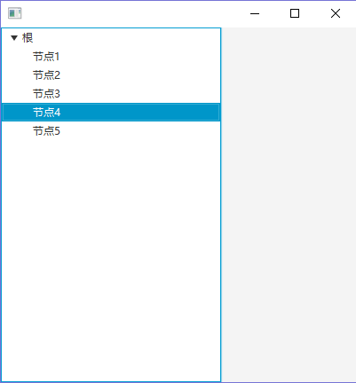

# JavaFX TreeView的创建，添加复选框及三种事件
---

## 1.简单TreeView的创建

流程

1. 创建树
2. 创建根
3. 创建节点

java代码

```java
public void start(Stage primaryStage) throws Exception {
	// 【1】创建树
	TreeView<String> treeView = new TreeView<String>();
	treeView.setVisible(true);
	// 【2】创建根
	TreeItem<String> rootItem = new TreeItem<String>("根");
	rootItem.setExpanded(true);
	treeView.setRoot(rootItem);
	// 【3】创建节点
	for(int i=1; i<=5; i++) {
		TreeItem<String> nodeItem = new TreeItem<String>("节点"+i);
		rootItem.getChildren().add(nodeItem);
	}
	
	// 创建边界布局
	BorderPane borderPane = new BorderPane();
	borderPane.setLeft(treeView);
	
	// 创建场景
	Scene scene = new Scene(borderPane, 400, 400);
	primaryStage.setScene(scene);
	// 显示
	primaryStage.show();
}
```

结果



## 2.为TreeView添加复选框

流程

1. 创建树
2. 创建根
3. 创建节点
4. 显示复选框
5. 可设置节点独立--选择父节点，子节点不会受到影响

java代码

```java
public void start(Stage primaryStage) throws Exception {
	// 【1】创建树
	TreeView<String> treeView = new TreeView<String>();
	treeView.setVisible(true);
	// 【2】创建根
	CheckBoxTreeItem<String> rootItem = new CheckBoxTreeItem<String>("根");
	rootItem.setExpanded(true);
	treeView.setRoot(rootItem);
	// 【3】创建节点
	for(int i=1; i<=5; i++) {
		CheckBoxTreeItem<String> nodeItem = new CheckBoxTreeItem<String>("节点"+i);
		rootItem.getChildren().add(nodeItem);
	}
	
	// 【4】显示复选框
	treeView.setCellFactory(CheckBoxTreeCell.<String>forTreeView());
	
	// 【5】可设置节点独立--选择父节点，子节点不会受到影响
	rootItem.setIndependent(true);
	
	// 创建边界布局
	BorderPane borderPane = new BorderPane();
	borderPane.setLeft(treeView);
	
	// 创建场景
	Scene scene = new Scene(borderPane, 400, 400);
	primaryStage.setScene(scene);
	// 显示
	primaryStage.show();
}	
```

结果


## 3.为TreeView添加勾选事件(1)

流程

1. 创建树
2. 创建根
3. 创建节点
4. 显示复选框
5. 可设置节点独立--选择父节点，子节点不会受到影响
6. 为每一节点添加勾选事件

java代码

```java
// 【6】添加事件
nodeItem.selectedProperty().addListener((observable, oldValue, newValue) -> {
	if(newValue == true) {
		System.out.println(nodeItem + "--被勾选");
	} else {
		System.out.println(nodeItem + "--取消勾选");
	}
});
```

结果


## 4.为TreeView添加勾选事件(2)--同时得到父节点

流程

1. 创建树
2. 创建根
3. 创建节点
4. 显示复选框
5. 可设置节点独立--选择父节点，子节点不会受到影响
*6. 为每一节点添加勾选事件*
7. 添加事件， 会连带父节点

java代码

```java
nodeItem.addEventHandler(CheckBoxTreeItem.checkBoxSelectionChangedEvent(), (event) -> {
	CheckBoxTreeItem<Object> treeItem = event.getTreeItem();

	if (treeItem.isSelected()) {
		System.out.println(treeItem + "被勾选");
	} else {
		System.out.println(treeItem + "未被勾选");
	}
});
```

结果


## 5.为TreeView添加选择事件--不是勾选

流程

1. 创建树
2. 创建根
3. 创建节点
4. 显示复选框
5. 可设置节点独立--选择父节点，子节点不会受到影响
*6. 为每一节点添加勾选事件*
*7. 添加事件， 会连带父节点*
8. 选择节点，而不是勾选

java代码

```java
// 【8】选择节点，而不是勾选
treeView.getSelectionModel().selectedItemProperty().addListener((observable, oldValue, newValue)->{
	System.out.println(observable.getValue() + "--被选择");
});
```

结果


